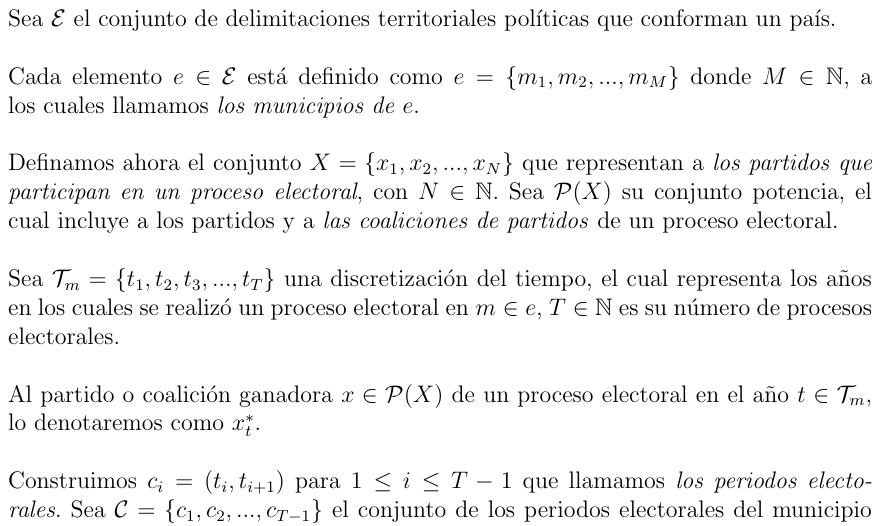

# Análisis y Modelado de las Preferencias Electoraeles en el estado de Zacatecas

En este repositorio encontrará las bases de datos de los nueve procesos electorales comprendidos entre los años 1998 y 2021 del estado de Zacatecas. Además, se incluyen dos bases de datos codificadas por tipo de cambio:

CODIFICACIÓN 1: Es el primer paso de la codificación, en el que se consideran ocho tipos de cambio.

CODIFICACIÓN 2: Es el segundo y último paso, en el cual se condensan los ocho tipos de cambio en cuatro.

Asimismo, encontrará el código para realizar el análisis descriptivo conformado por: tablas de frecuencias, cálculos de probabilidad, entropía de Shannon y energía con el objetivo de identificar comportamientos, así como el código para la creación de histogramas y mapas de calor. 

## Paquetes y bibliotecas 

El lenguaje de programación utilizado es Python 3.11.11, con variables tipo cadena (string) como entrada y la generación de tablas (DataFrames) y gráficos (Figures) como salida. Para lograr esto, se emplean las siguientes bibliotecas y paquetes:

* Pandas
* Numpy
* Matplotlib.pyplot
* Seaborn

## Datos empleados

Información de procesos electorales del estado de Zacatecas del año 1998 al 2021, obtenidas a través de la Plataforma Nacional de Transparencia y la página del Instituto Electoral del Estado de Zacatecas (IEEZ).
Donde el tipo de variables que las conforman son numéricas y de texto. 

## Descripción de las bases de datos

|Definición|
|:-------------------------------------------------------------------------:|
|Cambio: Proceso mediante el cual un estado se modifica pasando a otra condición.|
|Cambio: Proceso en el cual los partidos electos en un período se mantienen o son reemplazados por otros en el siguiente, generando una modificación en la composición política.|
|Cambio: Proceso mediante el cual los partidos elegidos en un período pueden continuar en el siguiente o ser sustituidos por otros, lo que resulta en una modificación en la composición política.|

|Definición|
|:-------------------------------------------------------------------------:|
|Período: Se refiere al intervalo de tiempo entre un proceso electoral y el siguiente, durante el cual se producen los cambios en el mandato municipal.|

|                             BASE INICIAL                                  |
|:-------------------------------------------------------------------------:|
|  Base de datos que detalla los partidos electos a nivel municipal en cada proceso electoral para cada estado. |

 Base de datos codificada de acuerdo con el tipo de cambio.

Se presenta en dos bases de datos distintas, cada una conformada por uno de los pasos de la codificación. 

Las bases de datos incluyen:

* Primera columna: Clave proporcionada por el INEGI para cada municipio.
* Segunda columna: Nombre del municipio correspondiente a la clave.
* Tercera a décima columna: Tipo de cambio por período.

## Análisis de Datos

Para realizar un análisis detallado de los tipos de cambio a nivel municipal, la base de datos conformada por 58 municipios fue segmentada en diferentes regiones geográficas basándose en la regionalización realizada por la Unidad de Planeación del Estado de Zacatecas en 2016.

### Regionalización de la entidad federativa

Desde el año 2005, el estado de Zacatecas se compone de 58 municipios, organizados en las siguientes ocho regiones:

* Centro
* Centro Sur
* Oeste
* Noroeste
* Norte
* Suroeste
* Sureste
* Sur

Las cuales están conformadas de la manera siguiente: 

|       CENTRO       |
|:-------------------------------------------------------------------------|

| Clave | Municipio | 
|:------------------:|:--------------:|
| 5       | Calera    | 
| 10     | Fresnillo    | 
| 12      | Genaro Codina   | 
| 13   | General Enrique Estrada    | 
| 17     | Guadalupe  | 
| 32    | Morelos    | 
| 37       | PANUCO | 
| 50  | Vetagrande   | 
| 56       |Zacatecas | 
| 57 | Trancoso   | 

|       CENTRO SUR      |
|:-------------------------------------------------------------------------|

| Clave | Municipio | 
|:------------------:|:--------------:|
|20   | Jerez    | 
| 43  | Susticacan  | 
| 46    | Tepetongo  | 
| 55  | Villanueva   | 

|      OESTE   |
|:-------------------------------------------------------------------------|

| Clave | Municipio | 
|:------------------:|:--------------:|
| 9   | Chalchihuites   | 
| 21     | Jimenez del Teul   | 
|40    | Sain Alto  | 
| 42  | Sombrerete    | 

|       NOROESTE       |
|:-------------------------------------------------------------------------|

| Clave | Municipio | 
|:------------------:|:--------------:|
|6     | Cañitas de Felipe Pescador    | 
| 14    | General Francisco R. Murguía   | 
 | 22     | Juan Aldama   | 
| 29  | Miguel Auza | 
| 39   | Río Grande  | 

|       NORTE     |
|:-------------------------------------------------------------------------|

| Clave | Municipio | 
|:------------------:|:--------------:|
| 7      | Cncepción del Oro | 
| 26     | Mazapil | 
| 27     | Melchor Ocampo   | 
| 41   | El Salvador   | 
| 51    | Villa de Cos | 

|      SUR OESTE      |
|:-------------------------------------------------------------------------|

| Clave | Municipio | 
|:------------------:|:--------------:|
| 31    | Monte Escobedo    | 
| 49    | Valparaiso    | 

|       SUR ESTE     |
|:-------------------------------------------------------------------------|

| Clave | Municipio | 
|:------------------:|:--------------:|
| 8     | Cuauhtemoc  | 
| 16    | General Panfilo Natera   | 
| 24    | Loreto| 
| 25  | Luis Moya   | 
| 35   | Noria de Ángeles  | 
| 36   | Ojocaliente    | 
| 38      | Pinos| 
| 52 | Villa García   | 
| 53     | Villa Gonzalez Ortega | 
| 54 | Villa Hidalgo   | 

|      SUR        |
|:-------------------------------------------------------------------------|

| Clave | Municipio | 
|:------------------:|:--------------:|
| 1 | Apozol    | 
| 2     | Apulco    | 
| 3     | Atolinga  | 
| 4   | Benito Juárez    | 
| 11  | Trinidad García de la Cadena  | 
| 15  | El Plateado de Joaquín Amaro   | 
| 18    | Huanusco | 
| 19 | Jalpa  | 
| 23      | Juchipila | 
| 28 | Mezquital del Oro   | 
| 30   | Momax | 
| 33 | Moyahua de Estrada  | 
| 34     | Nochistlán de Mejia| 
| 44 | Tabasco  | 
| 45 | Tepechitlán  | 
| 47   |  Teúl de González Ortega | 
| 48 | Tlaltenango de Sánchez Román | 
| 58     | Santa María de la Paz| 

### Codificación

Con el objetivo de analizar los cambios espacio-temporales en la entidad federativa, definimos la siguiente codificación:

### Herramientas empleadas

Se realizó un análisis de datos utilizando herramientas de estadística descriptiva, como tablas de distribución de frecuencias y histogramas para representar la información. Además, se calculó la entropía de Shannon para los datos, definida como:

Al igual, que se calculó la energía, definida como:

Con el objetivo de identificar comportamientos.  Este análisis se visualizó 
mediante mapas de calor.

## Referencias

Datos: Se llevó a cabo una revisión bibliográfica y se solicitó y buscó información sobre los  procesos electorales en Zacatecas. Esta búsqueda incluyó el uso de la Plataforma Nacional de Transparencia y las páginas web de los institutos electorales del estado:

* Zacatecas: https://ieez.org.mx/

Regiones: Se consideran ocho regiones, tal como se establece en el documento "Regionalización de la Unidad de Planeación", aprobado por la Asamblea General del COPLADEZ el 29 de septiembre de 2016.

* Unidad de Planeación del Estado de Zacatecas, u. (2016). Coordinación de Planeación
 Zacatecas [Recuperado el 2024, de Regionalización].

